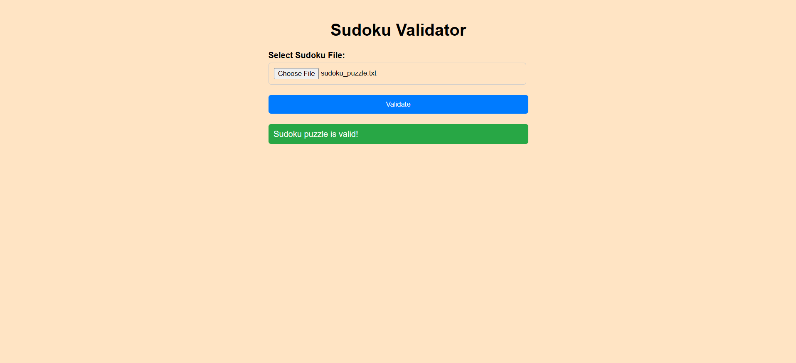

# Sudoku Validator

This project is a Python-based application to validate Sudoku puzzles. It includes a GUI interface for selecting and validating Sudoku puzzles stored in text files.

## Features
- **GUI Interface**: Built with Tkinter, the GUI allows users to select a file containing a Sudoku puzzle and validates the puzzle.
- **Input Parsing**: Reads and validates Sudoku puzzles from text files or string input.
- **Sudoku Validation**: Ensures the provided Sudoku puzzle adheres to the rules.

## Install Python dependencies (if required):
- The project uses the standard library and does not require additional dependencies. Ensure Python 3.x is installed.

## Example file content :
    ```
    5.3....7.
    6..195...
    .98....6.
    8...6...3
    4..8.3..1
    7...2...6
    .6....28.
    ...419..5
    ....8..79
    ```
1. The application will validate the puzzle and display one of the following messages:
    - "Sudoku puzzle is valid!" for a valid puzzle.
    - "Sudoku puzzle is not valid." for an invalid puzzle.
    - "Failed to read Sudoku puzzle from file." for an improperly formatted file.

## Run the Project

1. Graphical User Interface: python sudoku_gui.py

2. Web Interface: python web_app.py

## **Screenshots**

| Output Screen                |
|---------------------------- |
|  |

